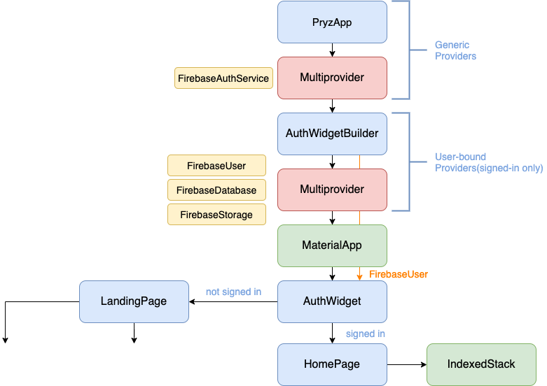

    # Pryzl Mobile App

The mobile app - Pryzl - for users

## Getting Started

This project is a starting point for a Flutter application.

A few resources to get you started if this is your first Flutter project:

- [Lab: Write your first Flutter app](https://flutter.dev/docs/get-started/codelab)
- [Cookbook: Useful Flutter samples](https://flutter.dev/docs/cookbook)

For help getting started with Flutter, view our
[online documentation](https://flutter.dev/docs), which offers tutorials,
samples, guidance on mobile development, and a full API reference.

## App Architecture

The two most important services in the app are FirebaseAuthService and FirestoreDatabase. These are created above the MaterialApp, so that all widgets have access to them. Here is a simplified widget tree for the entire app:



[Provider](https://pub.dev/packages/provider) is used in various ways:

* to create view models for widgets that need them (and dispose them when no longer needed).
* to provide scoped access to services from the widget classes.
* to propagate data synchronously down the widget tree.

The last point is particularly important. Reactive widgets can read data from asynchronous APIs (futures or streams), and make that data available synchronously to all their descendants. This minimizes API calls, improves performance, and minimizes boilerplate code.

## Adapting Screen and Font Size

Use [flutter_screenutil](https://pub.dev/packages/flutter_screenutil) plugin for
adapting screen and font sizes in order to display a reasonable layout on different
screen sizes.

Add the following imports to your Dart code:

```
import 'package:flutter_screenutil/flutter_screenutil.dart';
```

There is no need to initialize the instance of the ScreenUtil class, because
it should be set once in the Material App's home / initial route.

Pass the px size of the design draft:

```
ScreenUtil().setWidth(540) // Adapted to screen width
ScreenUtil().setHeight(200) // Adapted to screen height
ScreenUtil().setSp(24) // Adapter font

ScreenUtil.pixelRatio // Device pixel density
ScreenUtil.screenWidth // Device width
ScreenUtil.screenHeight // Device height
ScreenUtil.bottomBarHeight // Bottom safe zone distance, suitable for buttons with full screen
ScreenUtil.statusBarHeight // Status bar height , Notch will be higher Unit px
ScreenUtil.textScaleFactor // System font scaling facto
ScreenUtil().scaleWidth // Ratio of actual width dp to design draft px
ScreenUtil().scaleHeight // Ratio of actual height dp to design draft px
```

Note:

You should also use ScreenUtil for the paddings and other distance related properties.

## CI Pipelines

In order to ensure the quality and integration of our code, this repository relies on continuous integration using 2 pipelines.
The first pipeline is called the **Build** pipeline. It's active on all branches of the repository and are triggered once a pull request is made for the branch.
Once the pull request is made then the pipeline will be triggered after every push. You can disable the trigger by adding `[ci skip]` or `[skip ci]` to your commit message.
The **Build** pipeline performs the following steps:
* Run flutter analyze
* Run flutter tests
* Build android on debug mode
* Send slack notification

The **Develop Pipeline** is the second pipeline. It's only active on the develop branch and is triggered each time a pull request, push or commit is
made on the develop branch but because of the writing restrictions on the develop branch. You won't be able to trigger this pipeline unless you create
a pull request and merge it. This pipeline follows the same steps as the **Build** pipeline but it also preforms all other steps on iOS devices.

## Requirements && Dependencies

We should list and document all the dependencies we have in our git repo so that anyone
who joins later has a full guide of what to do in order to get everything running

### Installing Fonts

In order for app to build and be viewed as we intended it, please make sure all the fonts are installed. All fonts are located in the `assets/fonts` directory.

If you are running MacOS/Linux you could also use a script which facilitates this process. These
are the steps to follow :

```bash
cd assets/fonts
chmod +x load-fonts.sh
./load-fonts.sh
```


